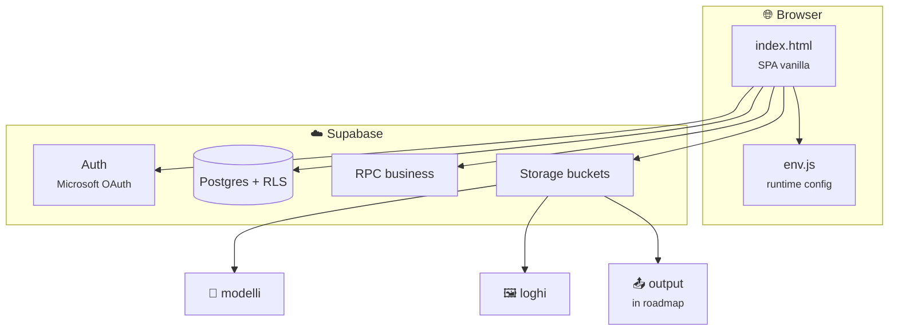

<div align="center">

# 🛡️ RSPP DVR Suite

**Gestionale web per Documenti di Valutazione dei Rischi**  
*Vanilla frontend · Supabase backend · Microsoft login*

<br>


<br>

*Single-page app senza framework — pronta per deploy statico (GitHub Pages o hosting privato)*

</div>

---

## ✨ Cosa fa

RSPP DVR Suite centralizza l’intero ciclo operativo del DVR: anagrafiche aziende, profili di rischio, valutazioni P×G, rilevamenti ambientali, testi normativi e preparazione alla generazione documentale.

| Area | Funzionalità |
|------|----------------|
| 🏢 **Anagrafica** | Aziende, profili, associazioni azienda↔profilo |
| ⚖️ **Valutazioni** | Compilazione rischi, calcolo indice e livello via RPC |
| 📊 **Rilevamenti** | Misure ambientali con esito automatico |
| 📝 **Testi DVR** | Catalogo testi per rischio e livello |
| 📁 **Modelli** | Template DOCX nel bucket `modelli` (admin/RSPP) |
| 🖼️ **Loghi** | Logo per azienda nel bucket `loghi` (editor+) |
| 📄 **Genera DVR** | Bozza esportabile *(generazione DOCX in roadmap)* |

---

## 🎯 Perché questa architettura

| Vantaggio | Dettaglio |
|-----------|-----------|
| 🚀 **Zero build** | Tutta l’UI in `index.html` — nessun bundler, deploy immediato |
| 🔐 **Sicurezza dati** | Row Level Security + ruoli applicativi |
| 🏢 **Enterprise login** | OAuth Microsoft tramite Supabase Auth |
| 📦 **Storage organizzato** | Bucket dedicati per modelli, loghi e output futuro |
| 🧩 **Modulo generazione** | Cartella `js/generazione/` pronta per il fill DOCX |

---

## 🏗️ Panoramica



---

## 📂 Struttura repository

```
RSPP-APP/
├── index.html              # SPA completa (nav, CRUD, modali, auth)
├── env.js                  # generato da .env (non committare segreti)
├── scripts/
│   └── generate_env_js.py
├── js/
│   └── generazione/        # modulo DOCX (in sviluppo)
│       ├── docx/           # mapping campi + fill template
│       └── adapters/       # lettura dati Supabase
└── supabase/
    ├── schema.sql          # tabelle, enum, FK, trigger
    ├── auth.sql            # sync auth.users → profiles
    ├── functions.sql       # RPC (associazioni, calcoli rischio)
    ├── seed.sql            # cataloghi iniziali
    ├── policies.sql        # RLS
    └── storage.sql         # bucket + policy storage
```

---

## 👥 Ruoli

| Ruolo | Lettura | Modifica dati | Modelli | Loghi |
|-------|:-------:|:-------------:|:-------:|:-----:|
| `viewer` | ✅ | — | — | — |
| `editor` | ✅ | ✅ | — | ✅ |
| `rspp` | ✅ | ✅ | ✅ | ✅ |
| `admin` | ✅ | ✅ | ✅ | ✅ |

> Il primo accesso crea il profilo in `public.profiles` con ruolo `viewer`. Promuovi almeno un utente a `admin` o `rspp` per la gestione completa.

---

## 📦 Storage Supabase

| Bucket | Contenuto | Path tipico |
|--------|-----------|-------------|
| `modelli` | Template DVR | `CODICE.docx` |
| `loghi` | Logo azienda | `{azienda_id}.png` |
| `output` | Documenti generati | `{azienda_id}/{run_id}/*.docx` |

---

## 🚀 Quick start

### 1 · Database

Esegui in **SQL Editor** (ordine consigliato):

1. `supabase/schema.sql`
2. `supabase/auth.sql`
3. `supabase/functions.sql`
4. `supabase/seed.sql`
5. `supabase/policies.sql`
6. `supabase/storage.sql`

> Se `storage.buckets` non esiste, apri prima la sezione **Storage** nella dashboard Supabase.

### 2 · Autenticazione Microsoft

1. **Supabase** → *Authentication* → *Providers* → **Azure (Microsoft)**
2. Inserisci `Client ID` e `Client Secret`
3. In **Azure AD** registra il redirect:  
   `https://<project-ref>.supabase.co/auth/v1/callback`
4. Promuovi un utente in `public.profiles` → ruolo `admin` o `rspp`

### 3 · Frontend

Crea `.env` in root:

```env
SUPABASE_URL=https://<project-ref>.supabase.co
SUPABASE_ANON_KEY=<anon-key>
```

Genera `env.js`:

```bash
python scripts/generate_env_js.py
```

L’app legge i valori da `window.__ENV`.

### 4 · Deploy statico

Checklist:

- [ ] Variabili ambiente configurate in CI o locale
- [ ] `env.js` generato prima del deploy
- [ ] Supabase → *Authentication* → *URL Configuration*:
  - **Site URL** = URL produzione (es. GitHub Pages)
  - **Additional Redirect URLs** include `.../index.html`

---

## 🔒 Sicurezza

- Esporre `SUPABASE_ANON_KEY` nel frontend è **accettabile** solo con **RLS attivo** su tutte le tabelle sensibili.
- **Non** inserire mai `service_role` nel client.
- Storage privato: accesso tramite policy + signed URL dove serve.

---

## 🗺️ Roadmap

- [ ] Modulo `js/generazione/` — fill DOCX da template + dati DB
- [ ] Upload risultati su bucket `output`
- [ ] Sezione **Output** in app (azienda → run → documenti)
- [ ] Edge Function (opzionale) per generazione lato server

---

<div align="center">

**Studio Rivelli Consulting** · Sistema RSPP  
*Migrazione SharePoint → Supabase*

<br>

<sub>Palette UI ispirata a Fluent / SharePoint · <code>#0078D4</code></sub>

</div>
