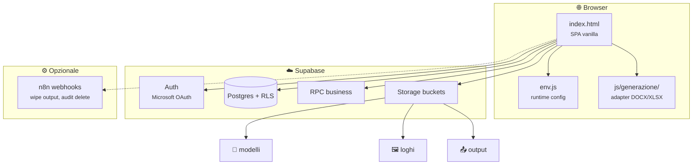

<div align="center">

# 🛡️ RSPP DVR Suite

**Gestionale web per Documenti di Valutazione dei Rischi**  
*Vanilla frontend · Supabase backend · Microsoft login*

<br>


<br>

*Single-page app senza framework — deploy statico (GitHub Pages o hosting privato)*

</div>

---

## ✨ Cosa fa

RSPP DVR Suite centralizza il ciclo operativo del DVR: anagrafiche, valutazioni P×G, rilevamenti ambientali, testi normativi e **generazione documentale** da template Word/Excel con output su cloud.

| Area | Funzionalità |
|------|----------------|
| 🏢 **Anagrafica** | Aziende, profili, fasi di lavoro, associazioni azienda↔profilo, checklist documenti DVR |
| ⚖️ **Valutazioni** | Matrice rischi per azienda/profilo, calcolo indice e livello via RPC |
| 📊 **Rilevamenti** | Misure ambientali con esito automatico (anche JSON dedicati per microclima, radon, rumore) |
| 📝 **Testi DVR** | Catalogo per rischio/livello, import da Excel |
| 📁 **Modelli** | Upload template nel bucket `modelli` (admin/RSPP) |
| 🖼️ **Loghi** | Un logo per azienda nel bucket `loghi` (editor+), gestione per singola azienda |
| 📄 **Generazione** | Wizard con anteprima, compilazione DOCX/XLSX, salvataggio su `output`, export ZIP |
| 📈 **Monitoraggio** | Statistiche aggregate (admin) |
| 👤 **Admin** | Gestione ruoli utenti |

---

## 🎯 Perché questa architettura

| Vantaggio | Dettaglio |
|-----------|-----------|
| 🚀 **Zero build** | UI in `index.html` + moduli JS caricati on demand — nessun bundler |
| 🔐 **Sicurezza dati** | Row Level Security + ruoli applicativi |
| 🏢 **Enterprise login** | OAuth Microsoft (Azure) tramite Supabase Auth |
| 📦 **Storage organizzato** | Bucket `modelli`, `loghi`, `output` |
| 🧩 **Adapter documentali** | Un adapter per codice catalogo in `js/generazione/adapters/` |

---

## 🏗️ Panoramica



---

## 📂 Struttura repository

```
RSPP-APP/
├── index.html                 # SPA (navigazione, CRUD, auth, generazione)
├── env.js                     # Config runtime
├── _config.yml                # GitHub Pages / esclusioni Jekyll
├── js/
│   ├── generazione/
│   │   ├── adapters/          # Un modulo per documento (adapter.js, preview.html, …)
│   │   ├── docx-template-repair.js
│   │   ├── output-export.js   # Export ZIP documenti generati
│   │   ├── output-wipe.js     # Richiesta wipe totale output (n8n)
│   │   └── graphs/            # Grafici utilizzo storage output
│   ├── monitoraggio/          # Dashboard statistiche admin
│   ├── audit-delete-log.js    # Log cancellazioni catalogo (webhook n8n)
│   └── testi-dvr-import-xlsx.js
├── scripts/                   # Utility (es. template import testi DVR)
├── n8n-templates/             # Email HTML per flussi n8n
└── supabase/
    ├── schema.sql
    ├── auth.sql
    ├── functions.sql
    ├── seed.sql
    ├── policies.sql
    ├── storage.sql
    ├── storage_modelli_policies.sql
    └── migrations/            # Patch incremental (profilo_fasi, monitoraggio, …)
```

---

## 📄 Generazione documenti

Flusso tipico:

1. In **Anagrafica azienda** → seleziona i documenti da produrre (`documenti_catalogo` / `aziende_documenti`).
2. Carica il template in **Modelli** come `CODICE.docx` o `CODICE.xlsx` (bucket `modelli`).
3. In **Generazione** → scegli azienda e sede → **Genera** → wizard in anteprima → documento su bucket `output`.

Path output: `{azienda_id}/{CODICE}_YYYYMMDD.docx` (o `.xlsx`).

### Adapter implementati

Ogni adapter espone `window.GEN_ADAPTERS['CODICE']` con `validate`, `generateDocx` e/o `generateXlsx`, più `preview.html` per il wizard.

| Codice | Formato |
|--------|---------|
| `APPENDICE_A_ORGANIGRAMMA` | DOCX |
| `APPENDICE_B1_PROFILI` | XLSX |
| `APPENDICE_B2_MISURE` | DOCX (copertina + tabella sito) |
| `APPENDICE_B3_ALTRE_SEDI` | DOCX (stesso modello di B.2, sede da picker) |
| `MOD_MICROCLIMA` | DOCX |
| `MOD_VDT_ILLUMINAMENTO` | DOCX |
| `MOD_STRESS_LC` | DOCX |
| `MOD_EMERGENZE` | DOCX |
| `MOD_INCENDIO` | DOCX |
| `MOD_RUMORE` | DOCX |
| `MOD_VIBRAZIONI` | DOCX |
| `MOD_CHIMICO` | DOCX |
| `MOD_GAS_RADON` | DOCX |
| `NOTA_ANTINCENDIO` | DOCX |
| `NOTA_LAVORATRICI_MADRI` | DOCX |
| `PROC_INFORTUNI_NEARMISS` | DOCX |
| `VADEMECUM_ANTIRAPINA` | DOCX |
| `VADEMECUM_AGGRESSIONI` | DOCX |

Il seed in `supabase/seed.sql` elenca **altri codici** nel catalogo (appendici, moduli aggiuntivi, allegati). Per abilitarli: template in `modelli` + nuova cartella sotto `js/generazione/adapters/` seguendo un adapter esistente e `fields-map.md` per i placeholder Word.

---

## 👥 Ruoli

| Ruolo | Lettura | Modifica dati | Modelli | Loghi | Wipe output |
|-------|:-------:|:-------------:|:-------:|:-----:|:-----------:|
| `viewer` | ✅ | — | — | — | — |
| `editor` | ✅ | ✅ | — | ✅ | — |
| `rspp` | ✅ | ✅ | ✅ | ✅ | ✅ |
| `admin` | ✅ | ✅ | ✅ | ✅ | ✅ |

> Il primo accesso crea il profilo in `public.profiles` con ruolo `viewer`. Promuovi almeno un utente a `admin` o `rspp` per gestione completa.

---

## 📦 Storage Supabase

| Bucket | Contenuto | Path tipico |
|--------|-----------|-------------|
| `modelli` | Template DVR | `CODICE.docx` / `CODICE.xlsx` |
| `loghi` | Logo azienda | `{azienda_id}.png` (o jpg/webp/svg) |
| `output` | Documenti generati | `{azienda_id}/{CODICE}_YYYYMMDD.ext` |

Bucket privati: lettura/scrittura tramite policy RLS storage + signed URL dove serve.

---

## 🚀 Quick start

### 1 · Database

Esegui in **SQL Editor** (ordine consigliato):

1. `supabase/schema.sql`
2. `supabase/auth.sql`
3. `supabase/functions.sql`
4. `supabase/seed.sql`
5. `supabase/policies.sql`
6. `supabase/storage.sql`
7. `supabase/storage_modelli_policies.sql` (se separato dal deploy iniziale)

> Se `storage.buckets` non esiste, apri prima **Storage** nella dashboard Supabase.


## 🌐 Utilizzo concorrente

Deploy su **GitHub Pages** = istanza statica condivisa; ogni utente esegue l’app nel proprio browser. I dati e i file sono centralizzati su Supabase: le query e gli upload sono gestiti dal backend; non c’è locking ottimistico in UI (ultima scrittura vince). Pensato per un team ristretto (ordine di grandezza: pochi utenti interni).

---

<div align="center">

**Studio Rivelli Consulting** · Sistema RSPP  
*Supabase -> N8N*

<br>

<sub>Palette UI ispirata a Fluent / SharePoint · <code>#0078D4</code></sub>

</div>
